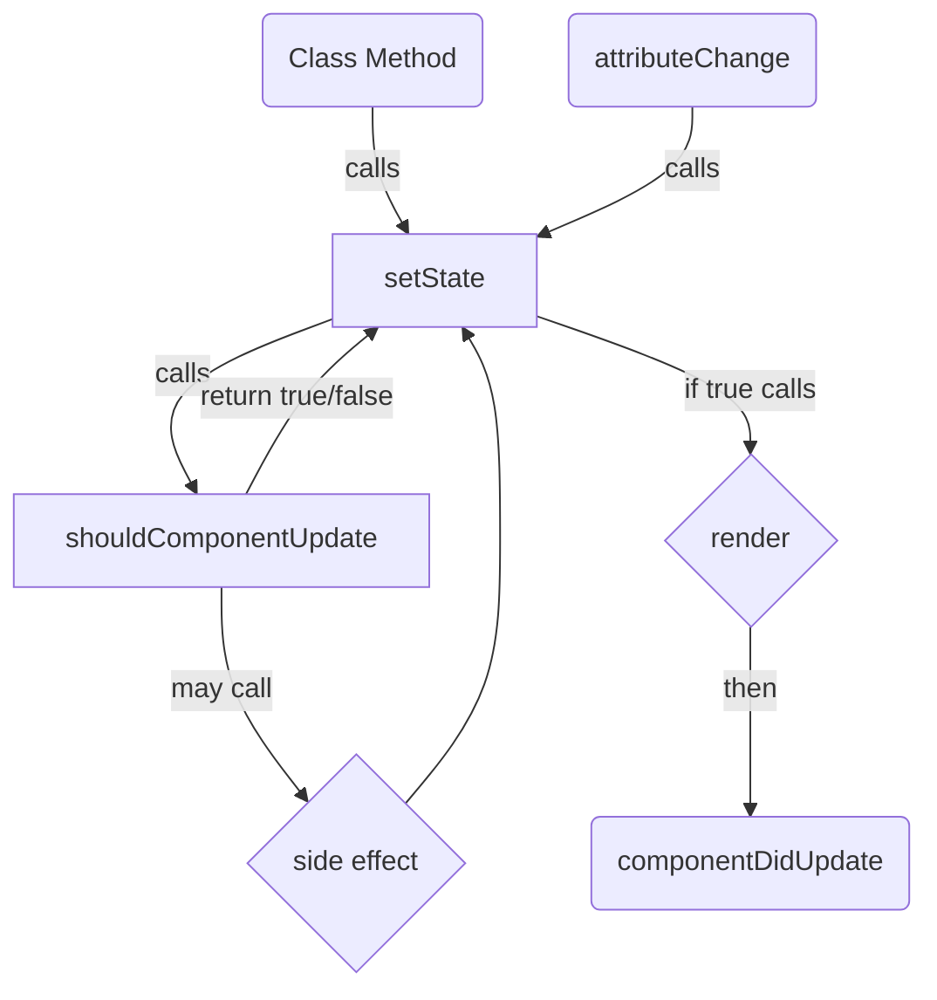

# running at localhost:1234

````
---
## Overview
This component render is an implementation of `Web Components`, which are a collection of 3 technologies:

- `Custom HTML Elements` - classes that define custom html tags, with encapsulated logic.
- `Shadow DOM` - Think vaguely similar to inserting an iframe into the element, but different api. Not a whole new document. Can encaspulate css and js from the rest of dom. Can close in --> out interaction.
- `HTML Templates` (_not used_ - no performance gain or dx benefits with current requirements)

[MDN Docs - Web Components](https://developer.mozilla.org/en-US/docs/Web/Web_Components)
[MDN Docs - Custom Elements](https://developer.mozilla.org/en-US/docs/Web/Web_Components)
## Important Web Component Details

Web Components have several built in `lifecycle callbacks` that we use:

| callback name | react ananlogue | description |
| --- | --- | --- |
| `getObservedAttributes` | _static getter - array of strings - somewhat like declaring props_ | attributes that the element will watch and fire `attributeChangedCallback` when changed. These mirror the attributes we open up to consumers (data-placement-id, data-property-id, etc). |
| `attributeChangedCallback` | rerun on prop change | Fires when any observed attribute is changed. We have this call setState, that triggers updates/re-renders. |
| `connectedCallback` |  _componentDidMount_ | called when the element is painted to the dom, after the constructor. useful for setting up the first render/calling fetches/etc. |
| `disconnectedCallback` |_componentDidUnMount_ | called when the element is removed from the dom. Good for cleaning up things like the intersection observer. |

See [StatefulComponent]() for our base class that contains these lifecycle methods.
---

## Directory Overview

To see an overview of creating a new component, or a nice walkthrough and an existing one, check out the [Getting Started](https://github.com/actionnetworkhq/bam/blob/master/bam-scripts/gettingStarted.md)

### [StatefulComponent](https://github.com/actionnetworkhq/blob/tree/master/bam-scripts/StatefulComponent.ts)

This is the base component class that the snippets extend. It contains lower level methods that components share. Some you can override in the child component, since it will depend on some compenent specifc logic.

__Basic Class Structure__

```mermaid
classDiagram
StatefulComponent <|-- ChildComponent
class StatefulComponent{
    static observedAttributes$
    _component shadowRoot
    _observer for lazyLoad
    state

    getState()
    setState(obj)
    fetchPlacement()
}

class ChildComponent {
    static styles$

    connectedCallback()
    shouldUpdateComponent(string array)
    render()
    componentDidUpdate()
    renderingHelpers()
}
````

**Methods**

<table>
<tr>
<th>callback name</th>
<th>should override</th>
<th>props</th>
<th>example</th>
</tr>

<tr>
<td>connectedCallback</td>
<td>✔️</td>
<td>~</td>
<td>

```js
connectedCallback() {
    if (this.isDeffered()) {
        this.render('')
    } else {
        this.fetchPlacement
    }
}
```

</td>
</tr>

<tr>
<td>shouldUpdateComponent</td>
<td>✔️</td>
<td>string[]</td>
<td>

```js
shouldUpdateComponent(updatedKeys) {
    if (updatedKeys.includes('somekey')) {
        doSomeSideEffect();
        return;
    }
}
```

</td>
</tr>

<tr>
<td>render</td>
<td>✔️</td>
<td></td>
<td>

```js
render() {
return `<div>Hello World</div>`
}
```

</td>
</tr>

<tr>
<td>componentDidUpdate</td>
<td>✔️</td>
<td></td>
<td>

```js
componentDidUpdate() {
    const el = this.queryId("id")
    id.removeEventListener('type', cb)
    id.addEventListener('type', cb)
}
```

</td>
</tr>

<tr>
<td>getState</td>
<td></td>
<td>string</td>
<td>

```js
this.getState("location");
```

</td>
</tr>

<tr>
<td>setState</td>
<td></td>
<td>{ [string]: any }</td>
<td>

```js
this.setState({
    placement: fetchedPlacement,
    location: locationToUse,
});
```

</td>
</tr>

<tr>
<td>fetchPlacement</td>
<td></td>
<td>cb?: (placement, location) => void</td>
<td>

```js
this.fetchPlacement((placement, location) =>
    this.formatPromotions(placement, locations)
);
```

</td>
</tr>

<tr>
<td>lazyLoad</td>
<td></td>
<td>string</td>
<td>

```js
this.lazyLoad("image-class-name");
```

</td>
</tr>

<tr>
<td>shadowDom queries</td>
<td></td>
<td>string</td>
<td>

```js
this.queryId("elment-id");
this.queryAll(".selector");
```

</td>
</tr>
</table>

### _How state/render lifecycle is managed_

These components handle their lifecyle in a similar way to the react class-based render lifecyle, however there are some slight differences to keep in mind. The main difference being these components manage their own state and own rendering, not an encompassing ui library like react. Meaning, the components methods are not called by some library expecting some return value. Lifecycle methods call other internal methods and the component handles setting its own innerhtml with an internal `this.render` method. NO VDOM HERE

I've set up the lifecylce methods, so if you're familiar with react class based components, you should be able to work through these components relatively easily.

### _State Data flow/Method callback flow:_



State should be set with `this.setState({})`, with an object containing the keys that should be updated. The setState method will handle setting the state and calling the `shouldComponentUpdate` method passing an array of keys that were updated.

```js
this.setState({ placement: placement, location: locationToUse });
```

The `shouldComponentUpdate` is in the same vein of the shouldComponentUpdate method in React, but modified for this inline method callback flow. It is passed an array of updated state keys from the setState method. Generally these are checked to trigger side effects (fetchPlacement) or to skip rendering (ex. nothing changed).

### _excess updates on mount_ \*

when a component is "mounted" (react friendly nomenclature) each existing data attribute fires the `attributeChangedCallback` lifecyle callback once. A quirk of custom elements I guess. As is, this would signal a `refetch` for each attribute. There are a couple of solutions to this:

-   implement some type of 'mounted' state, to restrict fetching until mounted.
-   shallow compare state updates & stop rendering if nothing changed.

I've gone with option 2 for simplicity. The setState method shallow compares state and sends and array of update state key strings to the shouldComponentUpdate method which will handle render/no render logic based on those keys.

Similar to dependency diffing in react, objects will always show different if passed to setState. Be careful of loops. `this.shouldRefetch` is a safeguard helper. Think of it as an inverted dependency array. Pass updated keys and an array of keys that should return false if they were updated.
